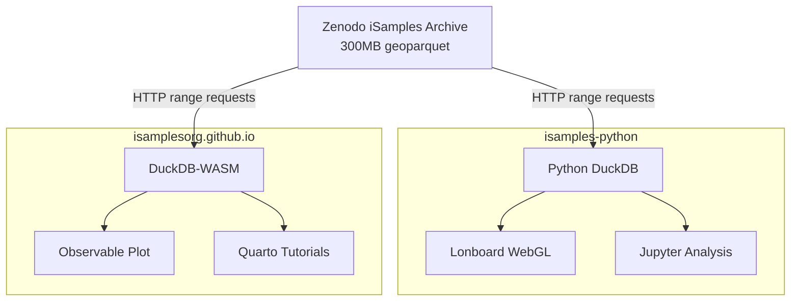

# Cross-Repository Alignment Strategy

**Date**: 2025-09-05  
**Repositories**: `isamples-python` ↔ `isamplesorg.github.io`  
**Status**: Both repos have successfully pivoted to offline-first geoparquet workflows

## Repository Relationship Overview

Both repositories are complementary components of the iSamples ecosystem that have independently evolved toward the same strategic direction: **geoparquet + DuckDB workflows** replacing central API dependencies.

### Parallel Evolution

Both repos experienced the **same critical event**: iSamples Central API going offline
- **isamples-python**: Contains sophisticated lonboard visualization patterns but needs API-independent examples
- **isamplesorg.github.io**: Successfully migrated to browser-based DuckDB-WASM + geoparquet tutorials

## Repository Roles & Complementary Functions

### `isamples-python` - Development & Analysis Environment
**Role**: Local development, sophisticated analysis, reusable Python patterns

**Strengths**:
- ⭐ **Excellent lonboard visualization** - `geoparquet.ipynb` contains zoom-layered rendering, interactive controls
- **Rich Python ecosystem** - GeoPandas, DuckDB, Polars, Ibis integration  
- **Jupyter development** - Interactive analysis with full Python scientific stack
- **Local data processing** - High-memory, CPU-intensive analysis capabilities

**Current Focus**:
- Advanced WebGL point cloud visualization with lonboard
- Multi-backend data processing (DuckDB, pandas, polars) 
- Complex geospatial analysis workflows
- Python client library (currently broken due to API offline)

### `isamplesorg.github.io` - Public Documentation & Tutorials  
**Role**: Public-facing education, browser-based demos, universal access

**Strengths**:
- ✅ **Proven geoparquet migration** - Complete transition from API to browser-based analysis
- **Universal browser access** - Zero installation, works on any device
- **Interactive tutorials** - Observable JavaScript + DuckDB-WASM
- **Performance optimized** - HTTP range requests, memory efficient
- **Educational focus** - Clear learning paths, comprehensive documentation

**Current Focus**:
- Browser-based data analysis tutorials (Quarto + Observable JS)
- Public-facing documentation and vocabulary system
- Performance demonstrations (300MB datasets in <100MB memory)
- SKOS vocabulary management and generation

## Data Flow & Technical Architecture Alignment

### Shared Technology Stack
Both repositories use identical core technologies:
- **DuckDB**: SQL analytical database (Python vs WASM versions)
- **Geoparquet**: Efficient geospatial data format
- **HTTP range requests**: Selective data access from large files
- **Zenodo archives**: Same data sources and URLs

### Data Access Patterns

### Performance Characteristics
**Common Benefits**:
- 5-10x faster than traditional pandas workflows
- 99% reduction in data transfer via selective queries
- Memory efficient analysis of large datasets
- Offline-capable once data is cached

## Strategic Alignment Opportunities

### 1. Pattern Standardization ⭐ **HIGH PRIORITY**

**Opportunity**: The lonboard visualization patterns in `isamples-python/examples/basic/geoparquet.ipynb` could be adapted for the website tutorials.

**Actions**:
- Extract reusable lonboard patterns from Python notebook
- Create Observable JS equivalents using lonboard's WebGL approach
- Standardize color mapping, zoom layering, and interaction patterns
- Document shared visualization vocabulary

**Benefits**:
- Consistent user experience across local/web environments
- Leverage excellent lonboard work for public tutorials  
- Reduce duplication of visualization research

### 2. Data Source Coordination

**Current State**: Both repos access same Zenodo archives independently
**Opportunity**: Coordinate data source management and updates

**Actions**:
- Centralize data source URLs and metadata
- Create shared validation scripts for data integrity
- Coordinate data updates and versioning
- Document data access patterns for both environments

**File Location**: Both repos could reference shared `DATA_SOURCES.md`

### 3. Cross-Referencing & Learning Paths

**Opportunity**: Create clear pathways between browser demos and local development

**Website → Python Transitions**:
- "Try this analysis locally" links from tutorials → Jupyter notebooks
- Environment setup guidance for deeper analysis
- Advanced analysis patterns requiring Python ecosystem

**Python → Website References**:
- Link to browser demos from Python examples  
- Reference interactive tutorials for concept explanations
- Point to website documentation for context

### 4. Testing & Validation Alignment

**Shared Challenge**: Both repos need robust testing for geoparquet workflows
**Opportunity**: Coordinate test data and validation approaches

**Actions**:
- Share test datasets and expected results
- Coordinate data quality validation scripts  
- Create cross-platform compatibility tests
- Document known data issues and workarounds

## Implementation Strategy

### Phase 1: Documentation Alignment (Immediate)
1. **Create shared DATA_SOURCES.md** - Centralized data access documentation
2. **Cross-link repositories** - Clear navigation between repos in READMEs
3. **Align terminology** - Consistent language for geoparquet workflows
4. **Document handoff patterns** - When to use browser vs local analysis

### Phase 2: Pattern Extraction (Near-term) 
1. **Extract lonboard visualization library** from Python notebooks
2. **Create Observable JS visualization equivalents** 
3. **Standardize interaction patterns** - zoom, filtering, color mapping
4. **Document reusable components** for both environments

### Phase 3: Infrastructure Sharing (Medium-term)
1. **Shared data validation scripts** 
2. **Coordinated data source updates**
3. **Cross-platform testing framework**  
4. **Performance benchmarking tools**

## Recommended File Locations

### In `isamples-python/`:
- `CROSS_REPO_ALIGNMENT.md` (this document)
- `DATA_SOURCES.md` - Shared data source documentation
- `docs/website-integration.md` - Links and transitions to website
- Enhanced `examples/README.md` with website cross-references

### In `isamplesorg.github.io/`:
- `about.qmd` updates - Link to Python development environment
- `tutorials/index.qmd` - "Advanced Analysis" section pointing to Python repo
- `design/architecture.md` - Multi-repository ecosystem documentation

## Success Metrics

### Short-term (1-2 weeks)
- ✅ Clear documentation linking both repositories
- ✅ Shared data source documentation
- ✅ Coordinated terminology and concepts

### Medium-term (1-2 months)  
- ✅ Extracted reusable visualization patterns
- ✅ Observable JS adaptations of lonboard techniques
- ✅ Consistent user experience across environments

### Long-term (3-6 months)
- ✅ Shared infrastructure components
- ✅ Coordinated data updates and validation
- ✅ Seamless workflow transitions between repos

## Cross-Project Learning Insights

### Successful Independent Evolution
- Both teams arrived at same technical solution independently
- Validates geoparquet + DuckDB as optimal approach
- Shows strength of distributed development model

### Complementary Strengths
- Python repo: Deep analysis capabilities, rich ecosystem
- Website repo: Universal access, educational focus, performance optimization
- Together: Complete workflow from exploration to publication

### Technical Innovation Leadership
- Combined repositories demonstrate cutting-edge browser + local analysis
- Show how modern web platform capabilities enable "big data in the browser"
- Position iSamples as leader in accessible scientific computing

---

*This alignment strategy leverages the successful independent evolution of both repositories while maximizing their complementary strengths.*